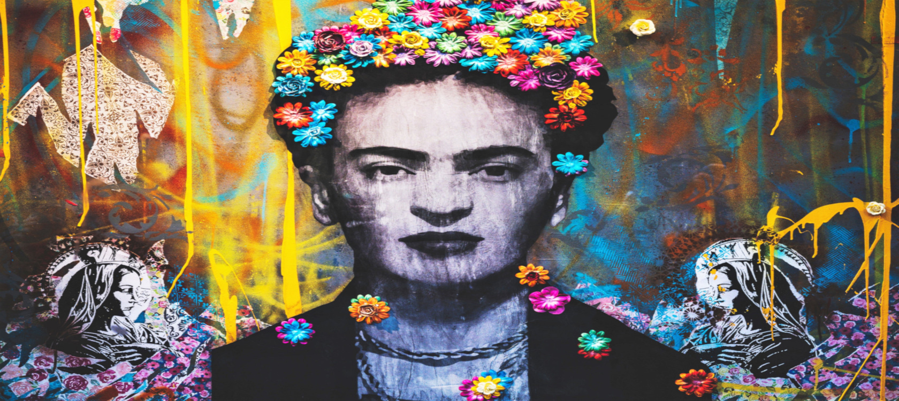
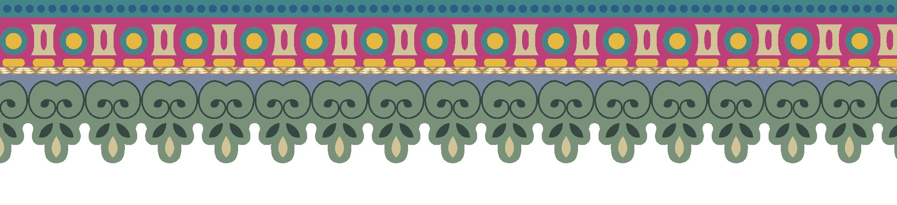
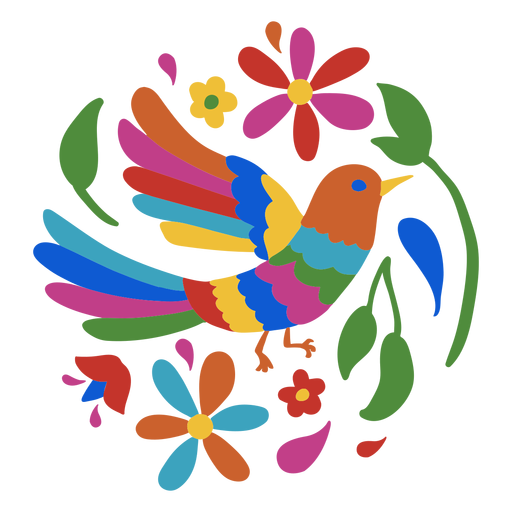
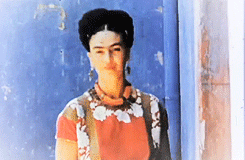
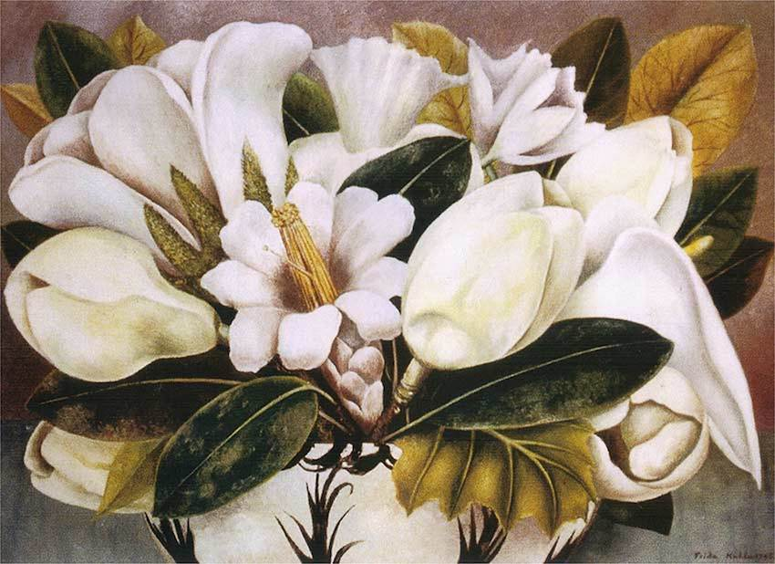
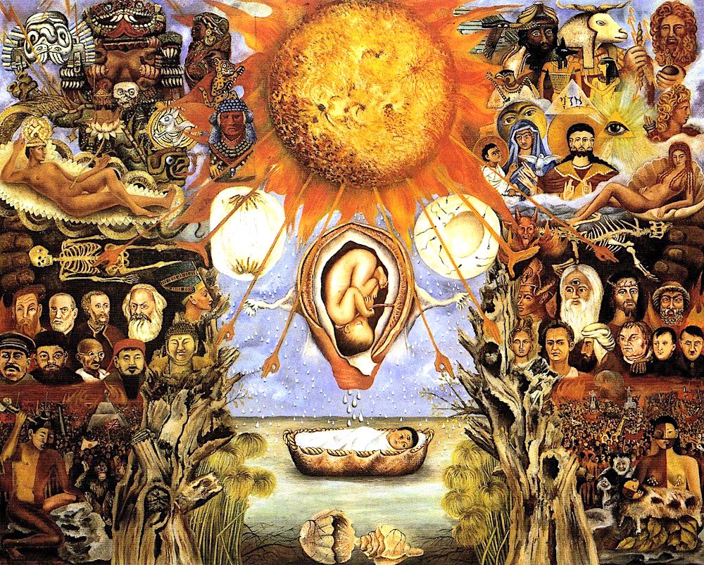
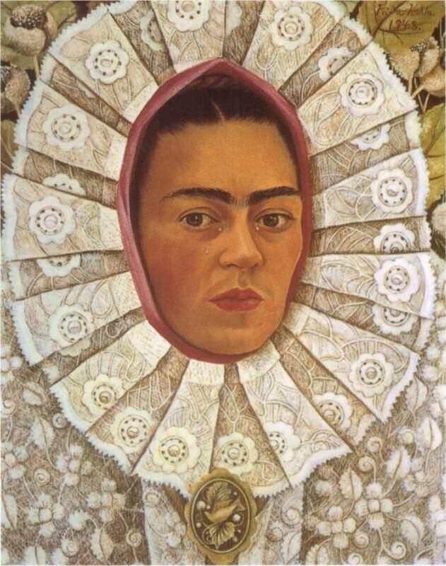
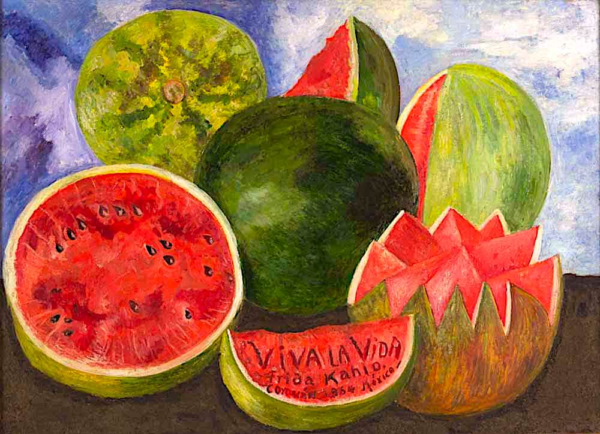

<!DOCTYPE html>
<html lang="en">
<head>
    <meta charset="UTF-8">
    <meta http-equiv="X-UA-Compatible" content="IE=edge">
    <meta name="viewport" content="width=device-width, initial-scale=1.0">
    
    <link rel="stylesheet" href="tribute-page.css">
    <link rel="shortcut icon" href="favicon.ico.ico" type="image/x-icon">
    <link href="https://fonts.googleapis.com/icon?family=Material+Icons" rel="stylesheet">
    <link rel="stylesheet" href="https://unpkg.com/transition-style">
    
    <title>Tribute Frida Kahlo</title>
    
</head>

<body>

<!-- Button Scroll-up -->
<button id="btnScrollToTop">
    <i class="material-icons md-48">arrow_upward</i>
</button>

<main>

<!-- Navigation bar -->
<header id="nav-bar">

<h1 class="title"><abbr title="Pies, ¿para qué los quiero si tengo alas para volar? - Frida Kahlo">Frida Kahlo</abbr></h1>
<ul class="menu">
    <li><a href="#img-line-pattern1" class="tribute-link">Lifetime Events</a></li>
    <li><a href="#img-line-pattern2" class="tribute-link">Artwork</a></li>
    <li><a href="https://www.frida-kahlo-foundation.org/" target="_blank" class="tribute-link">Official Page</a></li>
</ul>

</header>

<!-- Banner -->

    

<!-- Img caption -->

<strong>Magdalena Carmen Frida Kahlo y Calderón</strong> was a Mexican painter known for her many portraits, self-portraits, and works inspired by the nature and artifacts of Mexico.

<!-- Tribute info -->

Frida Kahlo was an artist inspired by her country's popular culture as well as by European influences. She employed a naïve folk art style to explore questions of identity, postcolonialism, gender, sexuality, class, and race in Mexican society. Her paintings often had strong autobiographical elements and mixed realism with fantasy. In addition to belonging to the post-revolutionary <em>Mexicayotl</em> movement, which sought to define a Mexican identity, Kahlo has been described as a surrealist or magical realist. She is known for painting about her experience of chronic pain.

<!-- Section: Lifetime Events -->
<h2 class="btn-golden">Frida's Lifetime Events</h2>

<section id="section-timeline">

    
<ul type="square">
    <li><strong>1907 - Her Birth:</strong> She was born on June 6th in Coyoacán, Mexico.</li>
    <li><strong>1913 - Polio's disease:</strong> The illness left her with a problem on her foot.</li>
    <li><strong>1922 - Started College:</strong> She attends Escuela Nacional Preparatoria and meets Rivera for the first time.</li>
    <li><strong>1925 - Traffic Accident:</strong> She was seriously injured during a crash between a tram and a bus.</li>
    <li><strong>1928 - Met Diego Rivera again:</strong> She joined the Mexican Communist Party. Rivera and Frida fell in love.</li>
    <li><strong>1929 - Married Rivera:</strong> Frida left the Communist party when Rivera was expelled from it.</li>
</ul>  

<ul type="square">
    <li><strong>1930 - 1st Miscarriage:</strong> The couple moved to San Francisco.</li>
    <li><strong>1931 - Met Dr. Leo Eloesser:</strong> He became her most trusted medical advisor.</li>
    <li><strong>1932 - 2nd Miscarriage:</strong> In the same year, her mother passed away. She lived in Detroit for a year.</li>
    <li><strong>1934 - 3rd Miscarriage:</strong> Her pregnancy was ended due to natural causes. Diego had an affair with Kahlo's sister.</li>
    <li><strong>1935 - Separated from Rivera:</strong> Travelled to New York with some female friends.</li>
    <li><strong>1937 - Welcomed Leon Trotsky:</strong> They stayed in the Blue House.</li> 
    <li><strong>1938 - 1st Solo Exhibition:</strong> Exhibition in <em>Julian Levy's</em> gallery.</li> 
  </ul>  
  

    
<ul type="square">
    <li><strong>1939 - Travelled to Paris:</strong> Exhibits her work in the <em>Renou & Colle</em> gallery. Divorces Rivera.</li>
    <li><strong>1940 - Remarried Rivera:</strong> Also, she travelled to San Francisco for treatment.</li>
    <li><strong>1943 - Awarded professorship:</strong> She became a professor at <em>'La Esmerelda'</em> school of Art.</li>
    <li><strong>1944 - Operation on her spine:</strong> Went to NY for her operation. Received national prize for painting <em>'Moses'</em>.</li>
    <li><strong>1954 - Her Death:</strong> She died in the Blue House due to pneumonia.</li>   
    <li><strong>1958 - Museo Frida Kahlo opened:</strong> Following the wishes of Rivera who died in 1957.</li>   
</ul>  

</section>

<!-- Quotes -->
<section id="section-quotes">

A three-second animated photo of Frida Kahlo who is smiling

“I don't paint dreams or nightmares, I paint my own reality.”

"I am that clumsy human, always loving, loving, loving. And loving. And never leaving.”

“Nothing is absolute. Everything changes, everything moves, everything revolves, everything flies and goes away.”

“Nothing is worth more than laughter. It is strength to laugh and to abandon oneself, to be light. Tragedy is the most ridiculous thing.”

</section>

<!-- Section: Artwork -->

<h2 class="btn-golden">Frida Kahlo's Art</h2>

<section id="section-artwork">
    

    
    
<abbr title="Self-portrait with necklace of thorns (1940)"></abbr>

    
<abbr title="Magnolias (1945)"></abbr>

    
<abbr title="Moses (1945)"></abbr>

    
<abbr title="Self-portrait (1948)"></abbr>

    
<abbr title="Viva la vida Watermelons (1954)"></abbr>

    
<abbr title="The Two Fridas (1939)"></abbr>

    
<abbr title="Self-portrait along the border line between Mexico and The US (1932)">
    </abbr>

    
<abbr title="The Wounded Deer (1946)"></abbr>

<a href="https://www.fridakahlo.org/frida-kahlo-paintings.jsp" target="_blank" class="btn-gold">View More</a>

</section>

<!-- Videos -->
<section id="section-videos">
    

<iframe src="https://www.youtube.com/embed/rxKR2cHmlPY" title="YouTube video player" class="video1" frameborder="200" allow="accelerometer; autoplay; clipboard-write; encrypted-media; gyroscope; picture-in-picture" allowfullscreen></iframe>

<iframe src="https://www.youtube.com/embed/B9XYtPqWLB4" title="YouTube video player" class="video2" frameborder="200" allow="accelerometer; autoplay; clipboard-write; encrypted-media; gyroscope; picture-in-picture" allowfullscreen></iframe>

</section>

<!-- Footer -->

<footer>   
    

    

Page created by &copy; Josie Lima 2022

    

    

Paintings from <a href="https://www.fridakahlo.org/" target="_blank">Fridakahlo.org</a>

</footer>

 

</main>

</body>
</html>
